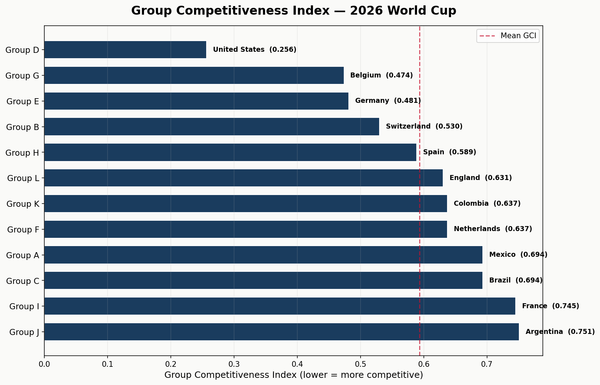
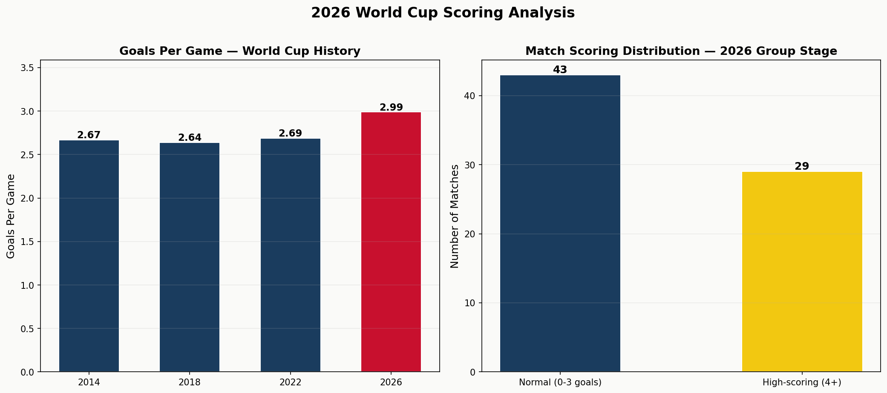
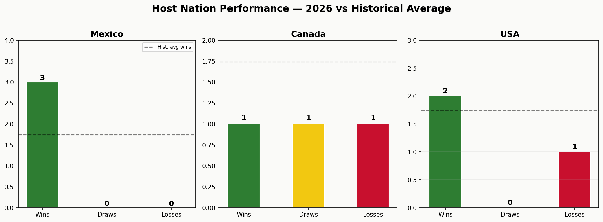
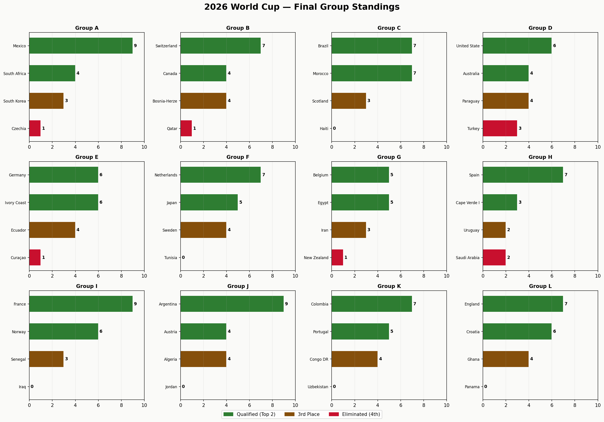
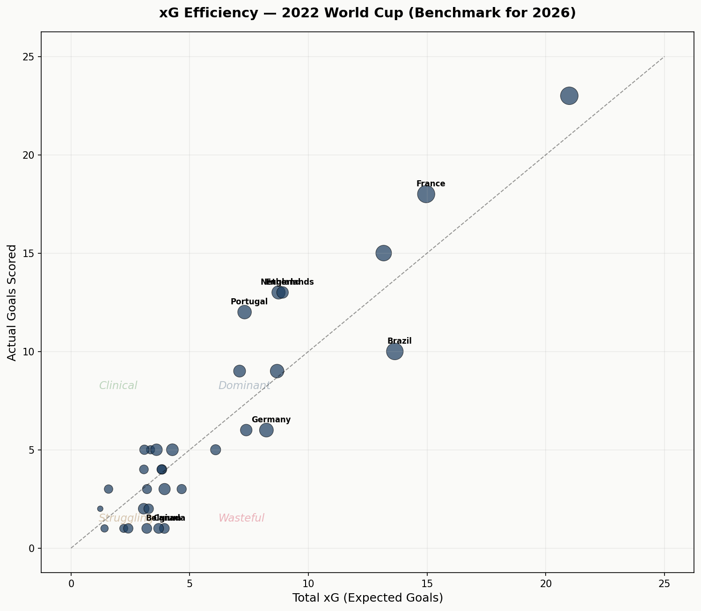
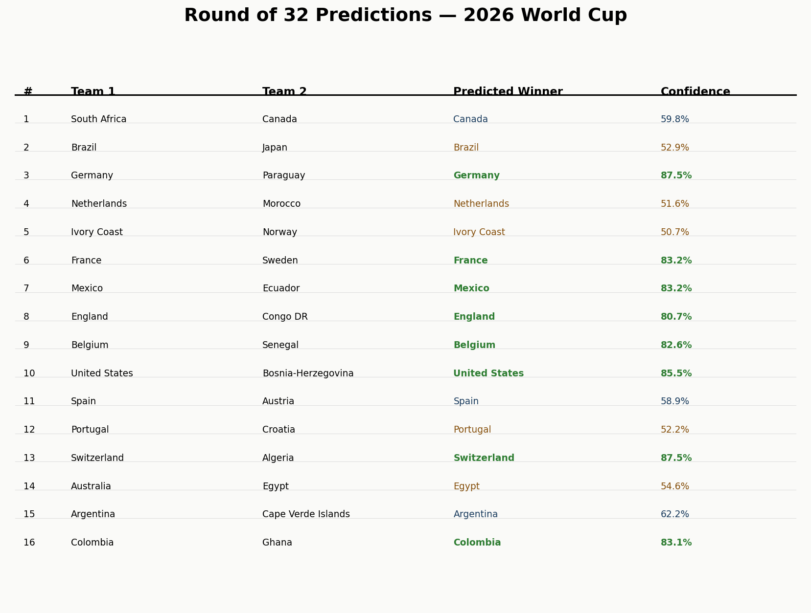
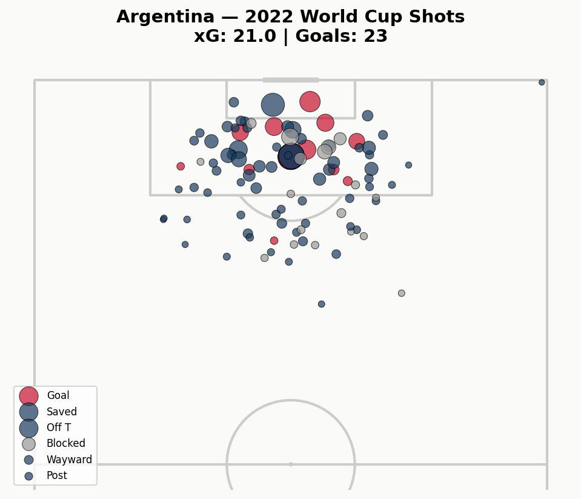
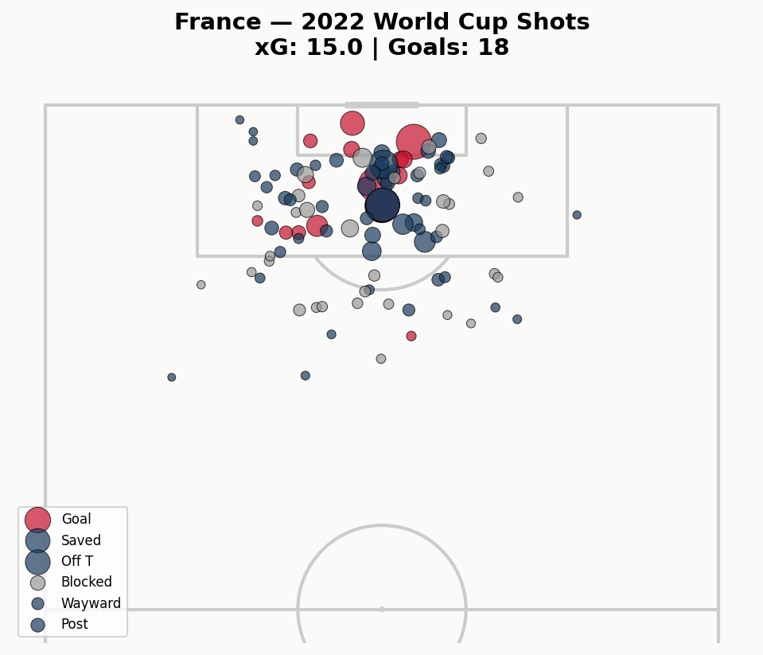
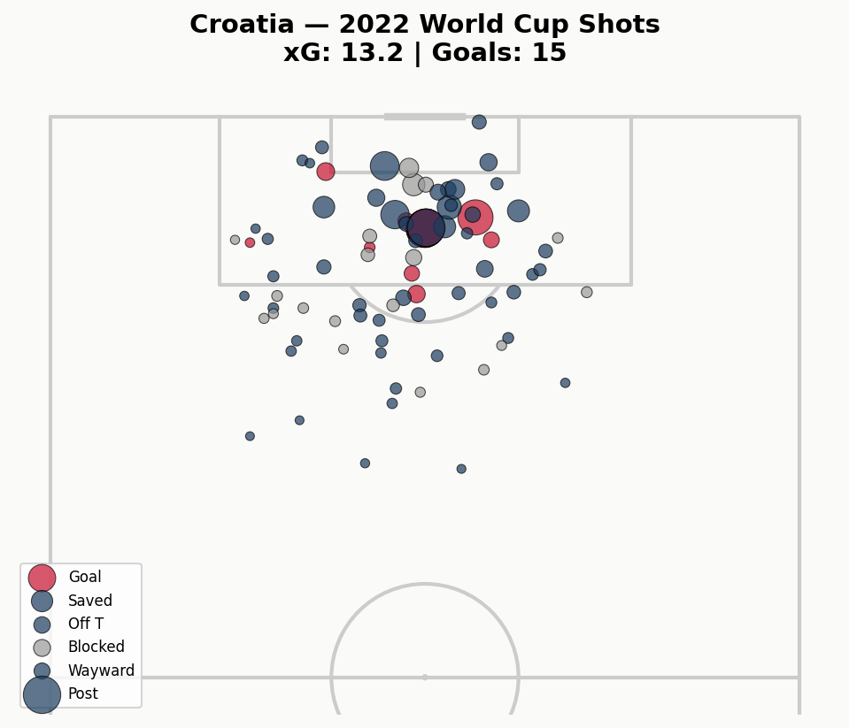
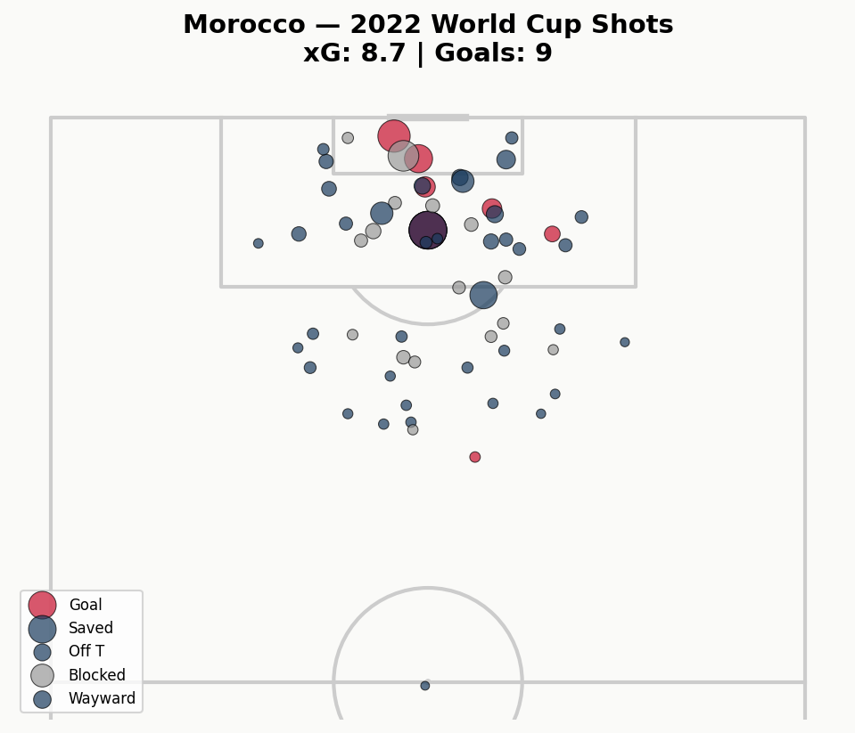

<div align="center">

# ⚽ El Mundial '26

### Live FIFA World Cup 2026 Analytics Dashboard

Real-time match data pipeline · Original Group Competitiveness Index · xG benchmarking · Knockout predictions · Interactive dark-theme Streamlit app — **built live during the 2026 World Cup.**

<br>

[](https://el-mundial-26-pjdxl58gjmwggflt3gqbvz.streamlit.app/)

<br>


</div>

---

## 📋 Table of Contents

- [Overview](#-overview)
- [What Makes This Unique](#-what-makes-this-unique)
- [Key Findings](#-key-findings)
- [The Group Competitiveness Index](#-the-group-competitiveness-index)
- [Visualizations](#-visualizations)
- [Tech Stack](#-tech-stack)
- [Project Structure](#-project-structure)
- [Getting Started](#-getting-started)
- [Deploy to Streamlit Cloud](#-deploy-to-streamlit-cloud)
- [Data Freshness](#-data-freshness)

---

## 🌍 Overview

**El Mundial '26** is a full analytics pipeline and interactive dashboard for the FIFA World Cup 2026. It pulls live results from the football-data.org API, processes them through a series of analysis stages, and surfaces everything in a custom-styled Streamlit app — complete with interactive charts, a live commentary engine, and a fan voting system.

Unlike retrospective analyses, every number here was computed **during** the tournament, refreshing after each match day.

> **▶ [Launch the live app](https://el-mundial-26-pjdxl58gjmwggflt3gqbvz.streamlit.app/)**

---

## ✨ What Makes This Unique

- **🔴 Built during the live tournament** — the data pipeline connects to the football-data.org API and refreshes after each match day. Every figure is real, current data.
- **📊 Original Group Competitiveness Index (GCI)** — a custom metric, `GCI = std(points) / mean(points)`, that quantifies how evenly matched each group was. Group D was the most competitive (0.2564); Group J the least (0.7510).
- **🎨 Custom dark-theme UI** — hand-written CSS, a card-based layout, interactive Plotly charts, a live commentary engine, and a fan voting system. Zero default Streamlit styling.

---

## 🔑 Key Findings

| Metric | Value |
|--------|-------|
| 2026 group stage goals per game | **2.99** — vs 2.69 in 2022, the highest in modern WC history |
| Most competitive group | **Group D** · GCI = 0.2564 |
| Least competitive group | **Group J** · GCI = 0.7510 |
| 🇺🇸 USA record | 2W – 0D – 1L |
| 🇲🇽 Mexico record | 3W – 0D – 0L |
| 🇨🇦 Canada record | 1W – 1D – 1L |
| All 3 hosts qualified for R32 | ✅ Yes |
| Host average win rate | 66.7% — vs 58% historical average |

---

## 📐 The Group Competitiveness Index

A custom metric built for this project.

```
GCI = std(points) / mean(points)
```

**Lower GCI → more competitive group.** A higher GCI means a dominant winner pulled away from the pack.

| Group | GCI | Winner Pts | 4th Pts | Spread | Winner |
|:-----:|:---:|:----------:|:-------:|:------:|--------|
| D | **0.2564** | 6 | 3 | 3 | 🇺🇸 United States |
| G | 0.4738 | 5 | 1 | 4 | 🇧🇪 Belgium |
| E | 0.4815 | 6 | 1 | 5 | 🇩🇪 Germany |
| B | 0.5303 | 7 | 1 | 6 | 🇨🇭 Switzerland |
| H | 0.5890 | 7 | 2 | 5 | 🇪🇸 Spain |
| L | 0.6308 | 7 | 0 | 7 | 🏴󠁧󠁢󠁥󠁮󠁧󠁿 England |
| K | 0.6374 | 7 | 0 | 7 | 🇨🇴 Colombia |
| F | 0.6374 | 7 | 0 | 7 | 🇳🇱 Netherlands |
| A | 0.6935 | 9 | 1 | 8 | 🇲🇽 Mexico |
| C | 0.6935 | 7 | 0 | 7 | 🇧🇷 Brazil |
| I | 0.7454 | 9 | 0 | 9 | 🇫🇷 France |
| J | **0.7510** | 9 | 0 | 9 | 🇦🇷 Argentina |

**Group D** — the USA's group — was the most competitive, with every team within 3 points. Groups I and J were dominated by France and Argentina, who each won all three matches for a perfect 9 points.

---

## 📈 Visualizations

<table>
  <tr>
    <td width="50%" align="center"><b>Group Competitiveness Index</b><br></td>
    <td width="50%" align="center"><b>Goals Per Game</b><br></td>
  </tr>
  <tr>
    <td width="50%" align="center"><b>Host Nation Performance</b><br></td>
    <td width="50%" align="center"><b>Final Group Standings</b><br></td>
  </tr>
  <tr>
    <td width="50%" align="center"><b>xG Efficiency — 2022 Benchmark</b><br></td>
    <td width="50%" align="center"><b>Round of 32 Predictions</b><br></td>
  </tr>
</table>

### Shot Maps — 2022 Semi-finalists

<table>
  <tr>
    <td width="50%" align="center"><b>🇦🇷 Argentina</b><br></td>
    <td width="50%" align="center"><b>🇫🇷 France</b><br></td>
  </tr>
  <tr>
    <td width="50%" align="center"><b>🇭🇷 Croatia</b><br></td>
    <td width="50%" align="center"><b>🇲🇦 Morocco</b><br></td>
  </tr>
</table>

---

## 🛠 Tech Stack

| Component | Technology |
|-----------|-----------|
| **Language** | Python 3.11 |
| **Frontend** | Streamlit + custom CSS |
| **Charts** | Plotly (interactive), matplotlib + mplsoccer (shot maps) |
| **Data ingestion** | requests, football-data.org API v4 |
| **Data processing** | pandas, numpy |
| **xG analysis** | statsbombpy (StatsBomb open data) |
| **ML predictions** | scikit-learn (LogisticRegression) |

---

## 📁 Project Structure

```
el-mundial-26/
├── .streamlit/          # Streamlit theme & config
├── app/
│   └── app.py           # Main Streamlit dashboard
├── data/
│   └── processed/       # Cleaned, analysis-ready datasets
├── notebooks/
│   ├── 01_data_pipeline.py      # Fetch & clean live match data
│   ├── 02_group_analysis.py     # Group Competitiveness Index
│   ├── 03_xg_analysis.py        # xG benchmarking (StatsBomb)
│   ├── 04_prediction_model.py   # Knockout predictions (sklearn)
│   └── 05_visualization.py      # Generate charts & shot maps
├── outputs/             # Rendered charts (PNG)
├── .env.example         # Template for API credentials
└── requirements.txt
```

---

## 🚀 Getting Started

### Prerequisites

- Python 3.11
- A free API key from [football-data.org](https://www.football-data.org/)

### Installation

```bash
# Clone the repository
git clone https://github.com/lakshyaverma2004/el-mundial-26.git
cd el-mundial-26

# Install dependencies
pip install -r requirements.txt

# Add your API key
echo "FOOTBALL_DATA_API_KEY=your_key_here" > .env
```

### Run the pipeline

```bash
# Run the analysis stages in order
python notebooks/01_data_pipeline.py
python notebooks/02_group_analysis.py
python notebooks/03_xg_analysis.py
python notebooks/04_prediction_model.py
python notebooks/05_visualization.py
```

### Launch the app

```bash
streamlit run app/app.py
```

---

## ☁️ Deploy to Streamlit Cloud

1. Push this repo to GitHub.
2. Go to [share.streamlit.io](https://share.streamlit.io).
3. Connect your GitHub account.
4. Select this repo, with main file set to `app/app.py`.
5. Under **Advanced settings → Secrets**, paste your `FOOTBALL_DATA_API_KEY`.
6. Click **Deploy**.

---

## 🔄 Data Freshness

Re-run `01_data_pipeline.py` after each match day to refresh results — the downstream scripts automatically pick up the latest data.

xG analysis uses StatsBomb's 2022 World Cup data as a benchmark and will be updated once the official 2026 event data is released post-tournament.

---

<div align="center">

**Built by [lakshyaverma2004](https://github.com/lakshyaverma2004)** · Data from [football-data.org](https://www.football-data.org/) & [StatsBomb](https://statsbomb.com/)

⭐ Star this repo if you found it useful!

</div>
